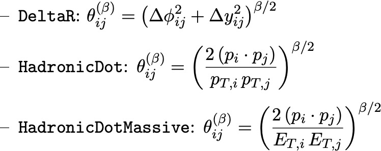
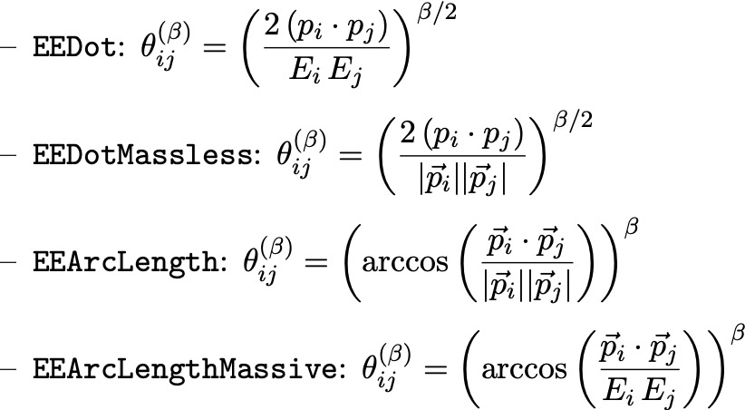

# EventGeometry

EventGeometry is a Python package as well as [FastJet contrib](https://fastjet.hepforge.org/contrib/) written primarily in C++. It incorporates the [Wasserstein](https://pkomiske.github.io/Wasserstein/) package for computing Wasserstein distances (known in particle physics as the Energy Mover's Distance) into the [FastJet](http://fastjet.fr) ecosystem.

## Documentation

The Wasserstein package has good Python and C++ [documentation](https://pkomiske.github.io/Wasserstein/docs/emd/). The main additions of the EventGeometry package are a [`FastJetEvent`](https://github.com/pkomiske/EventGeometry/blob/main/EventGeometry.hh#L123-L183) class that enables events composed either of a `PseudoJet` with constituents, or a vector of PseudoJets that can represent any particles.

### Particle Weights

The EMD requires a notion of "weight" to use for each particle. EventGeometry is quite flexible in this regard, and allows for the following options:

For use primarily with hadronic/pp events:

For use primarily with e+e- events:

For more details, see the [source code](https://github.com/pkomiske/EventGeometry/blob/main/EventGeometry.hh#L186-L237).

### Pairwise Distances

The EMD also requires a notion of distance between particles. EventGeometry supports several options:

For use primarily with hadronic/pp events:

For use primarily with e+e- events:

